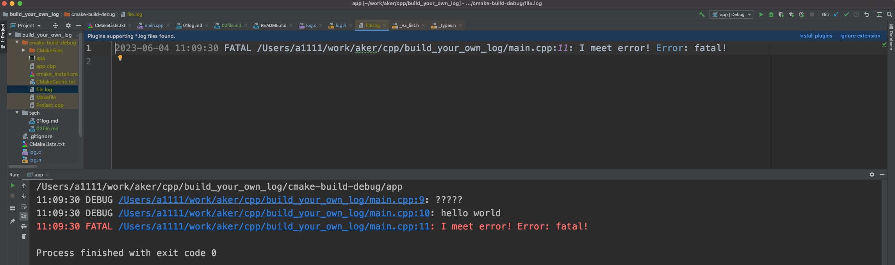

# File

本章实现将打印写入文件中。

## 实现

增加新的全局方法接受打印的`FILE*`目标，并保存至全局对象`L`中:

```diff
+#define MAX_CALLBACKS 12
// 设置日志处理对象
+typedef struct {
+   log_LogFn fn;   // 处理日志对象方法
+   void* udata;    // 保存目标.e.g. FILE*
+   int level;      // 该设置对应等级
+} Callback;
static struct {
    uint32_t level;
+   Callback callbacks[MAX_CALLBACKS];
} L;

+int log_add_callback(log_LogFn fn, void* udata, uint32_t level) {
+   for (int i = 0; i < MAX_CALLBACKS; i++) {
+       if (!L.callbacks[i].fn) {
+           L.callbacks[i] = (Callback){out_callback, udata, level};
+           return 0;
+       }
+   }
+   return -1;
+}
+int log_add_fp(FILE* fp, uint32_t level) {
+   return log_add_callback(out_callback, fp, level);
+}
```

在将log打印在控制台后，紧接着执行Callback:

```diff
-static void out_callback(Log_Event* ev) {
+static void out_callback(Log_Event* ev, bool is_file) {
-   char buf[16];
+   char buf[64];
    char* time_format = "%H:%M:%S";
+   if (is_file) time_format = "%Y-%m-%d %H:%M:%S";
    ...

void log_log(uint32_t level, const char* file, uint32_t line, const char* fmt, ...) {
    ...
    if (level >= L.level) {
        FILE* f = stdout;
        if (level >= LOG_WARN) f = stderr;
        init_event(&ev, f);
        va_start(ev.ap, fmt);
-       out_callback(&ev);
+       out_callback(&ev, false);
        va_end(ev.ap);
    }
+   for (int i = 0; i < MAX_CALLBACKS; i++) {
+       Callback* cb = &L.callbacks[i];
+       if (cb->udata && level >= cb->level) {
+           init_event(&ev, cb->udata);
+           va_start(ev.ap, fmt);
+           cb->fn(&ev, true);
+           va_end(ev.ap);
+       }
+   }
}
```

## 测试

```c++
FILE* fp = fopen("file.log", "ab+");
log_add_fp(fp, LOG_WARN);
log_debug("?????");
log_debug("hello %s", "world");
log_fatal("I meet error! Error: %s!", "fatal");
fclose(fp);
```

