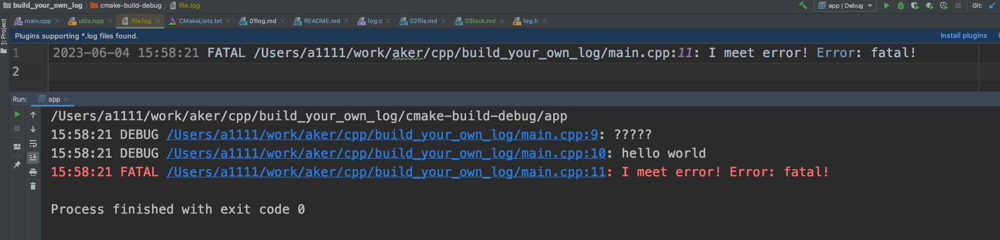

# Lock

本章使日志库支持锁机制。锁机制可能使性能降低，但是却能保证日志即使在多线程中也能正确输出。

## 实现

给全局变量L增加新加入的锁回调方法和锁回调对象，增加设置参数的方法:

```diff
+typedef void(*log_LockFn)(bool is_lock, void* lock_data);

static struct {
+   void* lock_data;
+   log_LockFn lock;
    ...
}

+void log_set_lock(log_LockFn fn, void* lock_data) {
+   L.lock = fn;
+   L.lock_data = lock_data;
+}
```

有了全局变量后，只需在打印前开启lock，打印后解开lock即可:

```diff
+static void lock(bool is_lock) {
+   if (L.lock) L.lock(is_lock, L.lock_data);
+}
void log_log(uint32_t level, const char* file, uint32_t line, const char* fmt, ...) {
    ...
+   lock(true);
    if (level >= L.level)
        ...
    for
        ...
+   lock(false);
}
```

## 测试

新增帮助类`utils.hpp`，测试方法:

```c++
int main() {
    FILE* fp = set_log_file("file.log", LOG_WARN);
    set_mutex_lock();
    log_debug("?????");
    log_debug("hello %s", "world");
    log_fatal("I meet error! Error: %s!", "fatal");
    fclose(fp);
    destroy_mutex_lock();
}
```


